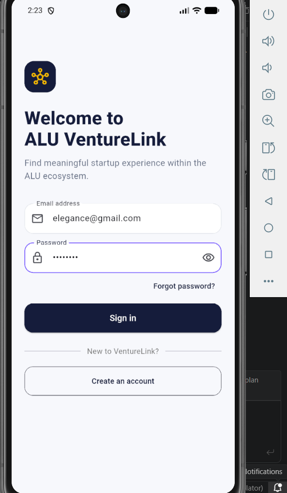
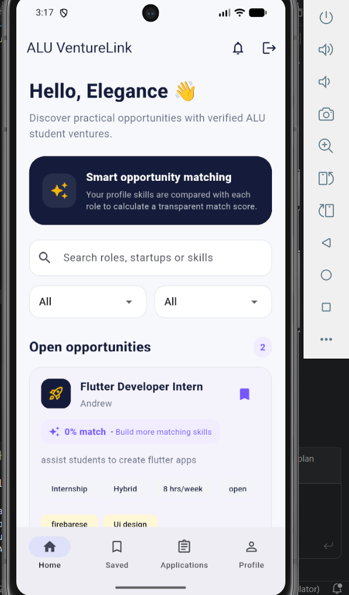
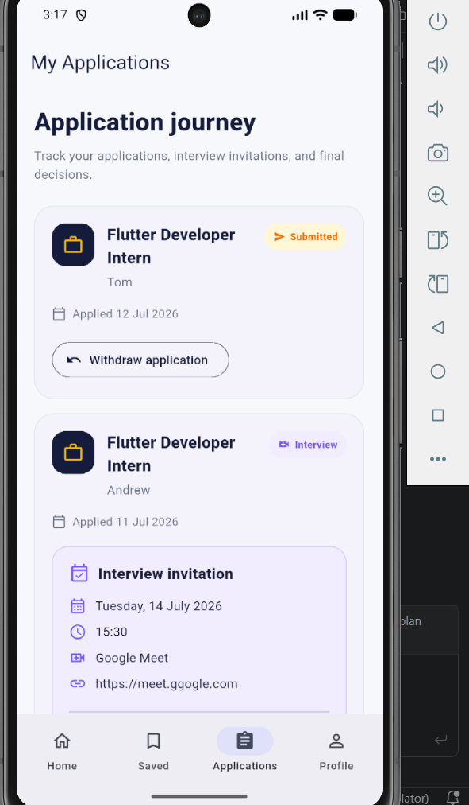
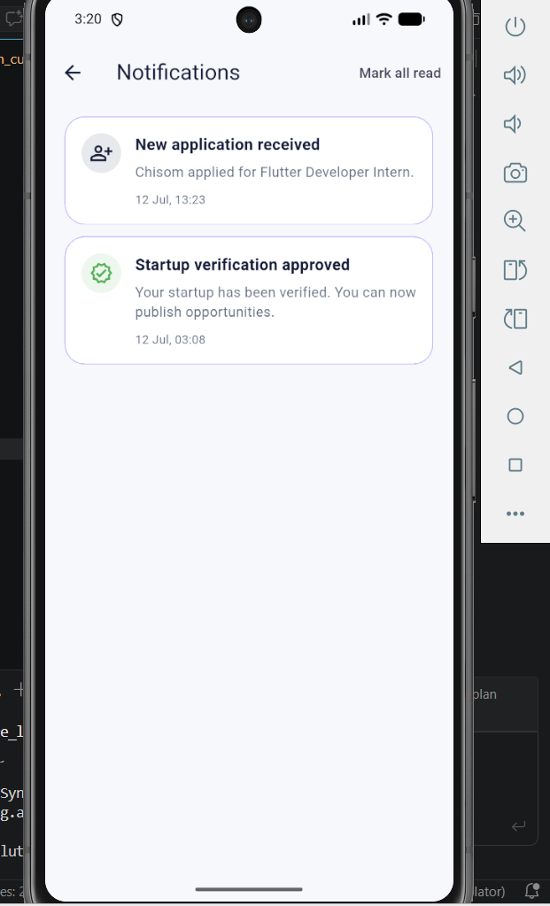
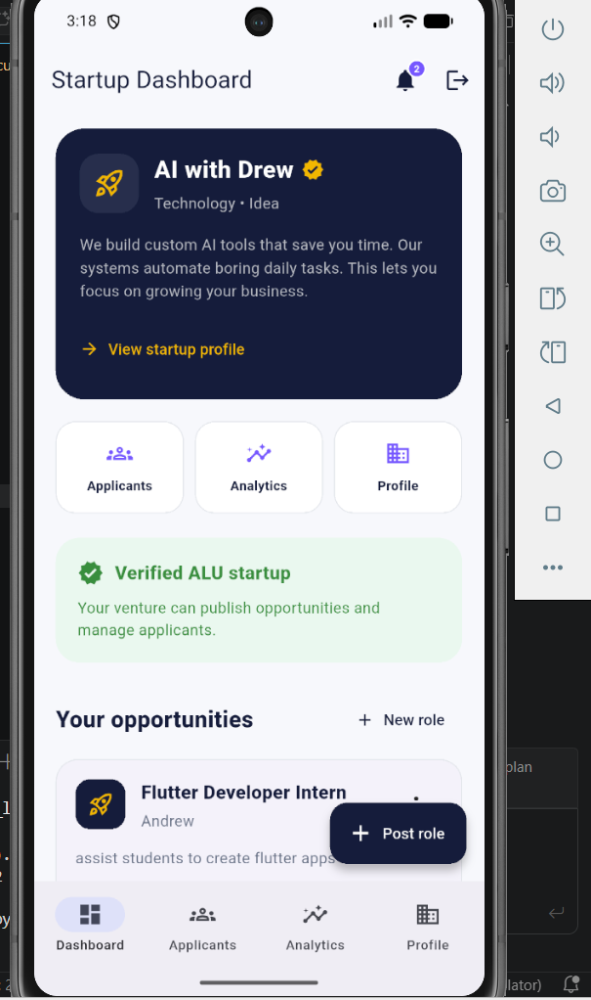
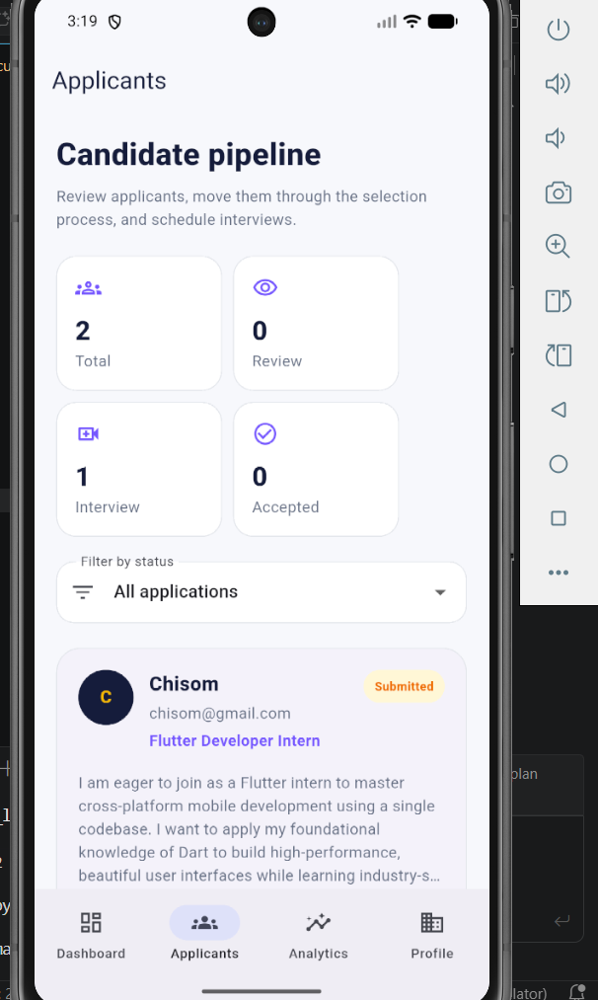
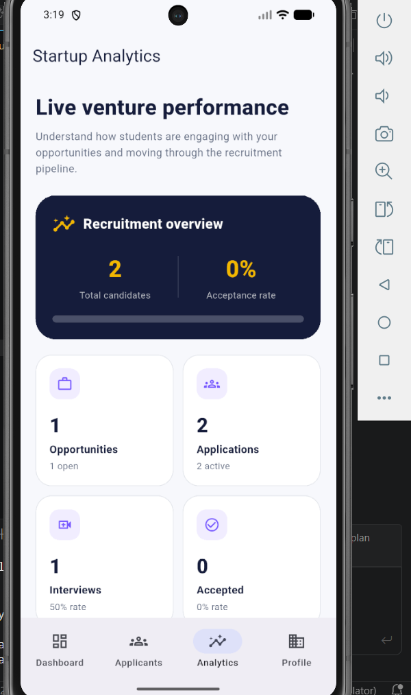
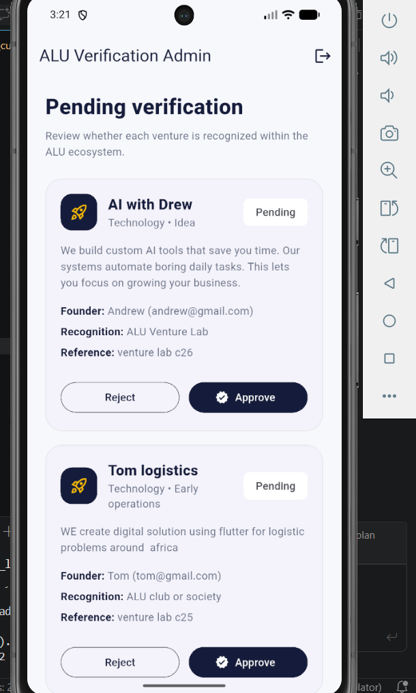

# ALU VentureLink

ALU VentureLink is a Flutter and Firebase mobile application that connects African Leadership University students with verified student-led startups. Students can discover opportunities, evaluate skill matches, save roles, apply, receive updates, and track interviews. Startup founders can create opportunities, manage candidates, schedule interviews, and view live recruitment analytics. Administrators verify startup profiles before they can publish opportunities.

## Project Overview

The platform was designed to solve a practical problem within the ALU ecosystem: students need easier access to startup experience, while student founders need a structured way to recruit suitable collaborators.

ALU VentureLink provides three role-based experiences:

- **Students:** discover, search, filter, save, and apply for opportunities.
- **Startups:** create opportunities, manage applications, schedule interviews, and view analytics.
- **Administrators:** review and approve or reject startup verification requests.

## Key Features

### Student Features

- Email and password authentication
- Role-based student navigation
- Real-time opportunity discovery
- Search by role, startup, or skill
- Filters for work mode and opportunity type
- Skill-based opportunity match percentage
- Saved opportunities using Firestore subcollections
- Opportunity application submission
- Application status tracking
- Interview date, time, mode, location, and preparation details
- Real-time in-app notifications
- Editable student profile
- Profile completion tracking
- Persistent bottom navigation

### Startup Features

- Startup profile creation
- ALU recognition and verification workflow
- Verified startup badge
- Opportunity creation, closing, reopening, and deletion
- Applicant pipeline management
- Application status updates
- Interview scheduling
- Real-time notifications
- Live startup analytics
- Opportunity-level performance metrics
- Professional startup profile and bottom navigation

### Administrator Features

- Dedicated administrator dashboard
- View pending startup verification requests
- Approve or reject startup profiles
- Add rejection feedback
- Restrict opportunity posting to approved startups

## Technology Stack

- **Flutter** — cross-platform application development
- **Dart** — application programming language
- **Firebase Authentication** — email and password authentication
- **Cloud Firestore** — real-time database and persistent storage
- **flutter_bloc / Cubit** — state management
- **Repository Pattern** — separation of data access and business logic
- **Equatable** — predictable state and model comparisons
- **Intl** — date and time formatting
- **Flutter Test** — unit and widget testing

## Architecture

The project follows a feature-first architecture with Cubit and the Repository Pattern.

```text
lib/
├── app/
├── core/
│   └── theme/
├── features/
│   ├── analytics/
│   ├── applications/
│   ├── auth/
│   ├── bookmarks/
│   ├── home/
│   ├── notifications/
│   ├── opportunities/
│   ├── profiles/
│   └── startups/
├── firebase_options.dart
└── main.dart
```

Each feature generally contains:

```text
feature/
├── data/
│   ├── models/
│   └── repositories/
└── presentation/
    ├── cubit/
    ├── screens/
    └── widgets/
```

### Data Flow

```text
User Action
   ↓
Flutter Screen or Widget
   ↓
Cubit
   ↓
Repository
   ↓
Firebase Authentication or Cloud Firestore
   ↓
Repository Stream or Result
   ↓
Cubit State
   ↓
Updated User Interface
```

## Firestore Collections

The application uses the following main collections:

```text
users/{userId}
startups/{startupId}
opportunities/{opportunityId}
applications/{applicationId}
notifications/{notificationId}
users/{userId}/bookmarks/{opportunityId}
```

### Important Relationships

- A user has one role: `student`, `startup`, or `admin`.
- A startup profile uses the startup owner's user ID as its document ID.
- An opportunity stores the startup owner's ID.
- An application links a student, an opportunity, and a startup owner.
- A notification stores the recipient, sender, type, and related document ID.
- Bookmarks are stored under the individual student's user document.

## Firebase Security

The application uses Firestore Security Rules to enforce:

- authenticated access
- role-based permissions
- startup ownership
- student ownership of bookmarks
- startup ownership of opportunities
- student ownership of application submission
- startup access to applicants
- recipient-only notification access
- approved-startup checks before opportunity creation

Firebase client configuration is stored in `firebase_options.dart`. No service-account private key or backend client secret should be committed to the repository.

## Getting Started

### Prerequisites

Install:

- Flutter SDK
- Dart SDK
- Android Studio
- Android emulator or physical Android device
- Firebase CLI
- FlutterFire CLI
- Git

Confirm the Flutter environment:

```bash
flutter doctor
```

### Clone the Repository

```bash
git clone https://github.com/tifarekaseke/alu-venture-link.git
cd alu-venture-link
```

### Install Dependencies

```bash
flutter pub get
```

### Firebase Configuration

The project requires a Firebase project with:

- Email/Password Authentication enabled
- Cloud Firestore database created
- Android and Web apps registered

To configure another Firebase project:

```bash
dart pub global activate flutterfire_cli
flutterfire configure
```

Then publish the required Firestore Security Rules in the Firebase Console.

### Run the Application

List available devices:

```bash
flutter devices
```

Run on an Android emulator:

```bash
flutter run -d emulator-5554
```

Run on Chrome for diagnostic testing:

```bash
flutter run -d chrome
```

## Testing

Analyze the codebase:

```bash
flutter analyze
```

Run all automated tests:

```bash
flutter test
```

Generate coverage:

```bash
flutter test --coverage
```

The automated test suite covers:

- user role helpers
- profile model copying
- analytics calculations
- application interview logic
- withdrawal rules
- notification unread counts
- opportunity-card rendering

Manual integration testing was also completed using the Android emulator and Firebase Console.

## Main User Workflows

### Student Workflow

1. Register as a student.
2. Complete the student profile.
3. Browse or search opportunities.
4. Review the skill-match percentage.
5. Save an opportunity.
6. Submit an application.
7. Track the application status.
8. Receive an interview notification.
9. View interview details in My Applications.

### Startup Workflow

1. Register as a startup.
2. Create a startup profile.
3. Submit the startup for verification.
4. Wait for administrator approval.
5. Publish an opportunity.
6. Receive student applications.
7. Move candidates through the pipeline.
8. Schedule interviews.
9. Review live analytics.

### Administrator Workflow

1. Sign in using an administrator account.
2. Review pending startup profiles.
3. Approve or reject each request.
4. Provide feedback when rejecting a profile.

## Screenshots


### Authentication and Student Experience

| Login | Opportunity Discovery |
|---|---|
|  |  |

| Applications | Notifications |
|---|---|
|  |  |

### Startup Experience

| Startup Dashboard | Candidate Management |
|---|---|
|  |  |

### Analytics and Administration

| Recruitment Analytics | Startup Verification |
|---|---|
|  |  |
```

## Design Decisions

- **Cubit/BLoC** was selected to provide explicit and testable application states.
- **Repository Pattern** separates Firebase operations from the user interface.
- **Real-time Firestore streams** update opportunities, applications, notifications, profiles, and analytics without manual refreshes.
- **Role-based navigation** gives each user type a focused experience.
- **Rule-based skill matching** provides a transparent recommendation score without claiming artificial intelligence.
- **Startup verification** protects platform quality by preventing unapproved ventures from posting opportunities.
- **Batched Firestore writes** keep application and notification updates consistent.

## Current Limitations

- The app currently uses in-app notifications rather than operating-system push notifications.
- Firebase Storage is not used in the current version, so profile pictures, startup logos, and résumé uploads are represented through text-based profile information.
- Administrator accounts are assigned manually in Firestore.
- Interview links are displayed as selectable text rather than automatically opening another application.
- Advanced recommendation models are not included.

## Future Improvements

- Firebase Cloud Messaging push notifications
- Résumé and startup-logo uploads
- Administrator activity logs
- Calendar integration for interview scheduling
- Deep links from notifications
- Recommendation ranking based on profile history
- Startup and student messaging
- Pagination for large datasets
- Stronger production security validation with custom claims
- Web deployment and responsive desktop layouts

## Documentation

The repository includes or should include:

```text
docs/
├── technical_report.pdf
├── system_architecture.png
├── firestore_schema.png
└── cubit_repository_workflow.png
```

## Author

**Tifare Elegance Kaseke**  
African Leadership University  
Software Engineering

## License

This project was developed for academic purposes as part of an ALU software engineering assignment.